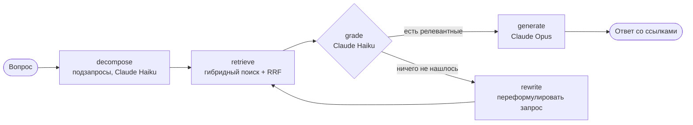

# zeppelin-rag

Вопросно-ответная система по базе знаний о цеппелинах и дирижаблях. Ответы генерирует
Claude, поиск и самокоррекция собраны в граф на **LangGraph**, качество оценивается
через **RAGAS**.

*Corrective RAG over a Russian-language zeppelin knowledge base (LangGraph + Claude), evaluated with RAGAS.*

## Как это работает



1. **decompose.** Быстрая модель разбивает вопрос на 1–3 подзапроса с конкретными
   названиями и терминами. Например, вопрос про блау-газ даёт подзапрос
   «LZ 127 Граф Цеппелин блау-газ топливо двигатели». Сам вопрос остаётся первым
   запросом.
2. **retrieve.** Гибридный поиск по 205 разделам базы знаний для каждого запроса.
   Используются локальные мультиязычные эмбеддинги (fastembed, ONNX, без API) и BM25 по
   основам слов. Лексическая часть ловит редкие термины вроде «блау-газ» и «оперение»,
   которые маленькая модель эмбеддингов пропускает. Результаты запросов сливаются
   методом Reciprocal Rank Fusion: фрагмент, найденный несколькими подзапросами,
   поднимается выше. В грейдер уходит не больше 8 фрагментов.
3. **grade.** Быстрая модель отбирает фрагменты, которые действительно отвечают на
   вопрос (structured output).
4. **rewrite.** Если релевантных фрагментов нет, запрос переформулируется и поиск
   повторяется, не более `max_rewrites` раз.
5. **generate.** Основная модель отвечает только по найденным фрагментам и ставит
   ссылки `[n]`. Если данных нет, она так и говорит.

## Почему RAGAS, а не Langfuse

Задача проекта — измерить качество RAG-пайплайна. RAGAS считает метрики офлайн, одной
командой, без сервера и аккаунта, поэтому оценку легко воспроизвести. Langfuse силён в
трассировке и мониторинге продакшена. Ему нужен запущенный сервер или облачный проект,
а для небольшого демо это лишняя инфраструктура.

| Метрика RAGAS | Что проверяет |
|---|---|
| `faithfulness` | утверждения ответа подтверждаются найденным контекстом (нет галлюцинаций) |
| `answer_relevancy` | ответ отвечает именно на заданный вопрос |
| `context_recall` | найденный контекст покрывает эталонный ответ |
| `context_precision_with_reference` | релевантные фрагменты стоят в выдаче первыми |
| `factual_correctness` | факты ответа совпадают с эталоном (F1 по утверждениям) |

В роли судьи выступает Claude Sonnet. Тестовый набор — 25 вопросов с подробными эталонными
ответами: [data/eval/testset.jsonl](data/eval/testset.jsonl).

## Результаты оценки

Последний прогон — 29.09.2026: 25 вопросов на углублённой базе знаний (17 документов,
205 разделов) с подробными эталонными ответами, поиск по подзапросам. Конфигурация:
- ответы — `claude-opus-5` с effort `medium`;
- подзапросы, оценка фрагментов и переформулировка — `claude-haiku-4-5`;
- судья RAGAS — `claude-sonnet-5`;
- поиск — `top_k=4` на запрос, `lexical_weight=0.5`, до 3 подзапросов, до 8 фрагментов
  после слияния.

Полные отчёты: [reports/summary.md](reports/summary.md) и
[reports/ragas_scores.csv](reports/ragas_scores.csv). Во втором файле есть оценки
и ответы по каждому вопросу. Эксперименты лежат в
[reports/experiments/](reports/experiments/).

| Метрика | Подзапросы (сейчас) | Один запрос, `top_k=4` | Один запрос, `top_k=5` |
|---|---|---|---|
| `faithfulness` | **0.974** | 0.974 | 0.986 |
| `context_precision_with_reference` | **0.958** | 0.920 | 0.917 |
| `context_recall` | **0.927** | 0.899 | 0.897 |
| `answer_relevancy` | **0.834** | 0.823 | 0.838 |
| `factual_correctness` | **0.693** | 0.724 | 0.667 |

### Поиск по подзапросам

Подзапросы подняли обе метрики поиска: `context_recall` 0.899 → 0.927 и
`context_precision` 0.920 → 0.958. Подробные эталоны содержат факты из соседних
разделов, и поиск по одному вопросу их не находит. Подзапрос с конкретными названиями
находит. Примеры по `context_recall`:
- «Зачем на „Графе Цеппелине“ использовали блау-газ?» — 0.50 → 1.00: подзапрос
  «LZ 127 Граф Цеппелин блау-газ топливо двигатели» нашёл разделы о двигателях и о
  самом корабле;
- «Какие двигатели стояли на „Гинденбурге“?» — 0.66 → 1.00;
- «Что такое высота давления?» — 0.83 → 1.00.

Одна просадка: «Почему „Гинденбург“ был наполнен водородом?» — 0.80 → 0.50. Поиск
нашёл нужный раздел о плотностях газов, но грейдер его отбросил, а решения грейдера
немного меняются от запуска к запуску. `factual_correctness` 0.724 → 0.693 — в
пределах разброса между прогонами: на отдельных вопросах эта метрика колеблется на
0.2–0.4.

Сначала подзапросы получались размытыми, например «Граф Цеппелин техническое
оснащение газ». Такой подзапрос находил общие разделы о газе, а не о корабле.
Промпт `decompose` требует писать подзапросы ключевыми словами с конкретными
названиями и запрещает общие слова вроде «оснащение» и «преимущества».

Цена режима: на каждый вопрос один дополнительный вызов быстрой модели и до 8
фрагментов вместо 4 во входе грейдера. Вызов основной модели не меняется, потому что
в неё уходят только отобранные грейдером фрагменты. Отключить режим:
`ZEPPELIN_MULTI_QUERY=0`.

### Подробные эталоны (28.09.2026)

До этого прогона эталоны были короткими (в среднем 196 символов) на базе из 127
разделов, поиск шёл по одному запросу.

**`factual_correctness`: 0.458 → 0.724.** Раньше метрика в основном штрафовала
верные подробности, которых не было в коротких эталонах. Метрика считает F1 по
утверждениям: верный факт ответа, которого нет в эталоне, снижает precision. Эталоны
переписаны с уровнем детализации ответов, строго по фактам базы знаний. Примеры:
- «Сколько человек погибло в катастрофе „Гинденбурга“?» — 0.47 → 1.00;
- «Сколько стоил билет на „Гинденбург“?» — 0.25 → 0.88;
- «Чем знаменит дирижабль „Франция“?» — 0.33 → 0.92.

**«Зачем дирижаблю хвостовое оперение?»: 0.18 → 0.72.** Здесь была настоящая
проблема: поиск не находил объяснения, почему корпус неустойчив. Раздел «Почему нужно
оперение, если дирижабль легче воздуха: момент Мунка» связал тему оперения с
моментом Мунка. Теперь поиск находит его первым, и ответ содержит ключевое
объяснение.

**`context_recall`: 0.970 → 0.899.** Это ожидаемая цена подробных эталонов, а не
ухудшение поиска. В подробный эталон попадают факты из соседних разделов, которые
поиск по вопросу не достаёт в топ-4. Например, в эталоне про блау-газ есть общий
объём «Графа Цеппелина» и то, что двигатели Maybach работали на двух видах топлива.
Эти факты лежат в документах о двигателях и о знаменитых кораблях, а не в разделе
про балласт. Поиск по-прежнему находит главный раздел для всех 25 вопросов.
Эту проблему затем решил поиск по подзапросам (см. выше).

### Что можно улучшить

1. ~~Проверить `top_k=5` для `context_recall`.~~ Проверено 29.09.2026, оставили
   `top_k=4`, цифры — в таблице выше. `context_recall` не выросла (0.899 → 0.897):
   недостающие факты лежат в разделах, которые поиск по вопросу не ставит и на 5-е
   место. Для вопроса про блау-газ пятым идёт нерелевантный раздел о газовых ячейках,
   и грейдер его отбрасывает. Лишний фрагмент только увеличивает стоимость запроса.
   Отчёт: [reports/experiments/top_k_5/](reports/experiments/top_k_5/).
2. **Показывать precision и recall `factual_correctness` раздельно**, чтобы отличать
   «ответ неполный» от «ответ подробнее эталона».
3. **Попросить модель отвечать короче и строго на вопрос**, если важна краткость.
4. ~~Подтягивать раздел про момент Мунка по вопросам про оперение.~~ Сделано.
5. ~~Дописать эталонные ответы подробнее.~~ Сделано.
6. ~~Поиск по подзапросам.~~ Сделано 29.09.2026, включён по умолчанию.
7. **Проверить стабильность грейдера.** Он иногда отбрасывает нужный фрагмент, как в
   вопросе про водород в «Гинденбурге». Можно повторить прогон несколько раз или
   передавать в генерацию и отброшенные фрагменты с высоким рангом.

## База знаний

17 документов на русском в [data/knowledge/](data/knowledge/), 205 разделов. Каждый
документ сначала даёт обзор темы, а затем углублённые разделы: механизмы («почему» и
«как»), выводы формул и расчёты с числами.

| Файл | Содержание |
|---|---|
| `01_history.md` | граф Цеппелин, LZ 1, DELAG, Первая мировая, «Граф Цеппелин», конец эпохи, Zeppelin NT; углублённо: истоки идеи (1863), патент 1898 года, LZ 2 и LZ 3, Хуго Эккенер, Версальский договор, наследие фирмы (ZF, Maybach, Dornier) |
| `02_types_construction.md` | жёсткие, полужёсткие и мягкие дирижабли; каркас, дюралюминий, газовые ячейки, бодрюш, обшивка, оперение; углублённо: момент Мунка и зачем оперение, давление газа в жёстком корабле, оболочка мягкого дирижабля, история дюралюминия, решётчатые балки |
| `03_form_factor_aerodynamics.md` | форма корпуса, удлинение, составляющие сопротивления, формула D = ½ρv²C_DV·V^(2/3), расчёт для «Гинденбурга», число Рейнольдса, P ∝ v³, закон квадрата-куба, присоединённая масса; углублённо: трение из первых принципов, расчёт оптимального удлинения, закон квадрата-куба в цифрах, шероховатость, кормовой винт, сопротивление в поворотах |
| `04_buoyancy_gases.md` | закон Архимеда, водород и гелий, влияние высоты, высота давления, перегрев газа, балласт, блау-газ, динамический подъём, баллонеты; углублённо: почему подъёмная сила не зависит от высоты до высоты давления, перепад давления в ячейке, производство водорода и гелия, взвешивание перед стартом, диффузия газа |
| `05_propulsion_performance.md` | двигатели Maybach и Daimler-Benz, винты, скорости, дальность, влияние ветра, энергоэффективность; углублённо: расход топлива, зависимость дальности от скорости, почему дизель, водоуловители, винты |
| `06_stability_control_operations.md` | устойчивость, момент Мунка, органы управления, прочность, мачты, эллинги, погода; углублённо: момент Мунка в цифрах, присоединённая масса и инерция, ручное управление, типы мачт, эллинги |
| `07_famous_airships.md` | характеристики LZ 127, LZ 129, LZ 130, Akron/Macon, Shenandoah, R100/R101, «Норвегия», «Италия», «СССР В-6»; углублённо: USS Los Angeles, отказ в гелии для LZ 130, конструкция Akron и Macon, R100, итоги службы «Графа Цеппелина» |
| `08_disasters_safety.md` | катастрофы «Гинденбурга», R101, Akron, Macon, Shenandoah и их уроки; углублённо: типичные механизмы гибели, катастрофа «Италии», расследование «Гинденбурга», что изменилось после катастроф |
| `09_modern_airships.md` | Zeppelin NT, Airlander 10, Pathfinder 1, Flying Whales, современные ниши; углублённо: проблема разгрузки грузового дирижабля, гибридная схема, дефицит гелия, стратосферные платформы |
| `10_early_airships_competitors.md` | Жиффар, «Франция», Шварц, Сантос-Дюмон, Лебоди, Парсеваль, Шютте-Ланц; почему победила схема Цеппелина; углублённо: двигатель как препятствие XIX века, размер и скорость, дирижабли в России до 1917 года, вклад Шютте-Ланц |
| `11_engineering_details.md` | распределение массы, передача подъёмной силы на каркас, газовые клапаны и шахты, балласт, пожарная безопасность, оперение, моторные гондолы; углублённо: как строили цеппелин, испытания, связь и системы на борту, предел облегчения каркаса |
| `12_physics_worked_examples.md` | расчёты: подъёмная сила при разной температуре, перегрев газа, чистота газа, заполнение под высоту давления, сопротивление и мощность Zeppelin NT и «Графа Цеппелина», ветер, динамический подъём; углублённо: проектная оценка дирижабля на 20 т, трение из первых принципов, перепад давления, постоянство подъёмной силы |
| `13_navigation_weather.md` | счисление пути, астро- и радионавигация, высотомеры, метеоролог на борту, полёт по циклонам, грозы, посадка; углублённо: треугольник скоростей, время и долгота, воздушная скорость, радиосвязь, выбор высоты |
| `14_military_history.md` | армейские и флотские цеппелины, налёты на Лондон, SL 11, «высотные» корабли, корзина-наблюдатель, Тондерн, дирижабли-авианосцы, мягкие дирижабли Второй мировой; углублённо: итоги налётов, бомбардировщики Цеппелин-Штаакен, морская разведка, почему военные дирижабли проиграли |
| `15_passenger_service.md` | линия в Бразилию, рейсы и удобства «Гинденбурга», цеппелинная почта, арктический полёт 1931 года, почему дирижабли проиграли самолётам; углублённо: DELAG до войны, бортовая почта и сервис, почта и грузы, сравнение с летающими лодками |
| `16_airships_other_countries.md` | R34, «Диксмюд», итальянская школа Нобиле, советский Дирижаблестрой, гелиевый флот США, британская Имперская программа, Япония; углублённо: Долгопрудный, советские рекорды, США после жёстких дирижаблей, Кардингтон |
| `17_glossary.md` | словарь терминов: форма и аэродинамика, плавучесть, конструкция, управление; добавлены разделы: углублённая аэродинамика, газ и плавучесть, конструкция, навигация |

Каждый раздел `## ...` — отдельный фрагмент для поиска. Чтобы расширить базу, достаточно
добавить Markdown-файл с такими разделами.

## Запуск

Нужны Python 3.12+ и [uv](https://docs.astral.sh/uv/).

```bash
uv sync
cp .env.example .env   # вписать ANTHROPIC_API_KEY
```

Если ключ не привязан к workspace и API отвечает `must include the anthropic-workspace-id
header`, добавьте в `.env` строку `ANTHROPIC_WORKSPACE_ID=wrkspc_...` или создайте ключ
внутри нужного workspace.

Задать вопрос:

```bash
uv run zeppelin-ask "Почему гелий поднимает меньше водорода?" --trace
```

Прогнать оценку RAGAS (отчёты попадут в `reports/summary.md` и `reports/ragas_scores.csv`):

```bash
uv run zeppelin-eval            # весь тестовый набор
uv run zeppelin-eval --limit 3  # быстрый прогон
```

При первом запуске fastembed скачивает модель эмбеддингов (~220 МБ).

Если проект лежит в папке, которая синхронизируется с iCloud (например, `~/Documents`),
iCloud помечает файлы `.venv` скрытыми. Python 3.12.12+ пропускает скрытые `.pth`, и
команды падают с `ModuleNotFoundError: No module named 'zeppelin_rag'`. Держите окружение
в папке, которую iCloud не синхронизирует:

```bash
rm -rf .venv && mkdir .venv.nosync && ln -s .venv.nosync .venv && uv sync
```

## Telegram-бот

Бот [@zeppelin_asking_bot](https://t.me/zeppelin_asking_bot) отвечает на вопросы через
тот же граф. Он работает в режиме long polling, поэтому ему не нужен ни публичный
адрес, ни HTTPS.

- `/start`, `/help` — приветствие и примеры вопросов;
- любой текст — вопрос. Ответ приходит со списком источников `[n]`;
- лимит — 20 вопросов в сутки на пользователя (`TELEGRAM_DAILY_LIMIT`), потому что
  каждый вопрос тратит кредиты Anthropic. Счётчики хранятся в памяти и обнуляются в
  полночь и при перезапуске;
- `TELEGRAM_ALLOWED_USERS` — белый список ID пользователей. Пусто — бот открыт всем;
- вопросы длиннее 500 символов отклоняются.

Запуск локально (токен — в `.env`, см. [.env.example](.env.example)):

```bash
uv run zeppelin-bot
```

Одновременно может работать только один экземпляр бота. Если запустить второй,
например на сервере, Telegram вернёт первому ошибку `Conflict`. Перед запуском на
сервере остановите локальный.

### Развёртывание на сервере (systemd)

На сервере с Linux и systemd под root:

```bash
git clone https://github.com/vasilylead-lang/zeppelin-rag.git /opt/zeppelin-rag
cd /opt/zeppelin-rag
cp .env.example .env && nano .env   # TELEGRAM_BOT_TOKEN, ANTHROPIC_API_KEY, ANTHROPIC_WORKSPACE_ID
bash deploy/install.sh
```

[deploy/install.sh](deploy/install.sh) ставит `uv` и создаёт системного пользователя
`zeppelin`. Затем он устанавливает зависимости, скачивает модель эмбеддингов (~220 МБ)
и запускает службу [deploy/zeppelin-bot.service](deploy/zeppelin-bot.service) с
автоперезапуском. Обновление после `git pull` — тот же `bash deploy/install.sh`.

```bash
journalctl -u zeppelin-bot -f      # логи
systemctl restart zeppelin-bot     # перезапуск
```

Серверу нужно около 1 ГБ памяти и доступ к `api.telegram.org`, `api.anthropic.com`,
PyPI и Hugging Face (для модели эмбеддингов).

### Docker

Если на сервере доступен Docker Hub, можно запустить через Docker:

```bash
docker compose up -d --build
```

Модель эмбеддингов попадает в образ при сборке, а `.env` передаётся при запуске и в
образ не копируется.

## Настройки

Всё задаётся переменными окружения, полный список — в [.env.example](.env.example).

| Переменная | По умолчанию | Роль |
|---|---|---|
| `ZEPPELIN_ANSWER_MODEL` | `claude-opus-5` | генерация ответа |
| `ZEPPELIN_FAST_MODEL` | `claude-haiku-4-5` | оценка фрагментов и переформулировка |
| `ZEPPELIN_JUDGE_MODEL` | `claude-sonnet-5` | судья RAGAS |
| `ZEPPELIN_TOP_K` | `4` | сколько фрагментов достаётся из поиска по каждому запросу |
| `ZEPPELIN_LEXICAL_WEIGHT` | `0.5` | вес BM25 в гибридном поиске (0 — только эмбеддинги) |
| `ZEPPELIN_MAX_REWRITES` | `2` | лимит переформулировок запроса |
| `ZEPPELIN_MULTI_QUERY` | `1` | поиск по подзапросам (`0` — поиск только по вопросу) |
| `ZEPPELIN_MAX_SUBQUERIES` | `3` | сколько подзапросов строит `decompose` |
| `ZEPPELIN_MAX_CHUNKS` | `8` | сколько слитых фрагментов уходит в грейдер |

## Разработка

```bash
uv run pytest        # тесты не ходят в API: фейковые эмбеддинги и LLM
uv run ruff check .
```

CI (GitHub Actions) запускает ruff и pytest на каждый push и pull request.

## Структура

```
src/zeppelin_rag/
  knowledge.py   # Markdown -> фрагменты по разделам
  retriever.py   # гибридный поиск: fastembed + BM25, слияние подзапросов (RRF)
  llm.py         # вызовы Claude (Anthropic SDK)
  graph.py       # граф LangGraph: decompose -> retrieve -> grade -> rewrite/generate
  evaluate.py    # оценка RAGAS
  cli.py         # zeppelin-ask
  telegram_bot.py # zeppelin-bot: Telegram-бот поверх графа
data/knowledge/  # база знаний
data/eval/       # тестовый набор
deploy/          # systemd-служба и скрипт установки на сервер
```
