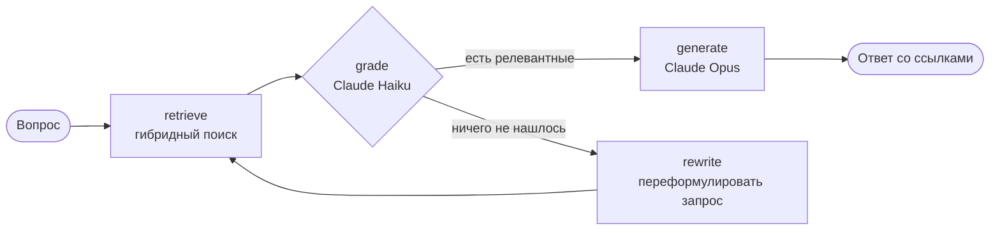

# zeppelin-rag

Вопросно-ответная система по базе знаний о цеппелинах и дирижаблях. Ответы генерирует
Claude, поиск и самокоррекция собраны в граф на **LangGraph**, качество оценивается
через **RAGAS**.

*Corrective RAG over a Russian-language zeppelin knowledge base (LangGraph + Claude), evaluated with RAGAS.*

## Как это работает



1. **retrieve.** Гибридный поиск по 205 разделам базы знаний. Используются локальные
   мультиязычные эмбеддинги (fastembed, ONNX, без API) и BM25 по основам слов.
   Лексическая часть ловит редкие термины вроде «блау-газ» и «оперение», которые
   маленькая модель эмбеддингов пропускает.
2. **grade.** Быстрая модель отбирает фрагменты, которые действительно отвечают на
   вопрос (structured output).
3. **rewrite.** Если релевантных фрагментов нет, запрос переформулируется и поиск
   повторяется, не более `max_rewrites` раз.
4. **generate.** Основная модель отвечает только по найденным фрагментам и ставит
   ссылки `[n]`. Если данных нет, она так и говорит.

## Почему RAGAS, а не Langfuse

Задача проекта — измерить качество RAG-пайплайна. RAGAS считает метрики офлайн, одной
командой, без сервера и аккаунта, поэтому оценку легко воспроизвести. Langfuse силён в
трассировке и мониторинге продакшена. Ему нужен запущенный сервер или облачный проект,
а для небольшого демо это лишняя инфраструктура.

| Метрика RAGAS | Что проверяет |
|---|---|
| `faithfulness` | утверждения ответа подтверждаются найденным контекстом (нет галлюцинаций) |
| `answer_relevancy` | ответ отвечает именно на заданный вопрос |
| `context_recall` | найденный контекст покрывает эталонный ответ |
| `context_precision_with_reference` | релевантные фрагменты стоят в выдаче первыми |
| `factual_correctness` | факты ответа совпадают с эталоном (F1 по утверждениям) |

В роли судьи выступает Claude Sonnet. Тестовый набор — 17 вопросов с эталонными
ответами: [data/eval/testset.jsonl](data/eval/testset.jsonl).

## Результаты оценки

Последний прогон — 28.09.2026: 25 вопросов на расширенной базе знаний
(17 документов, 127 разделов). Конфигурация:
- ответы — `claude-opus-5` с effort `medium`;
- оценка фрагментов и переформулировка запросов — `claude-haiku-4-5`;
- судья RAGAS — `claude-sonnet-5`;
- поиск — `top_k=4`, `lexical_weight=0.5`.

Полные отчёты: [reports/summary.md](reports/summary.md) и
[reports/ragas_scores.csv](reports/ragas_scores.csv). Во втором файле есть оценки
и ответы по каждому вопросу.

| Метрика | Все 25 | Исходные 17 | Новые 8 | Вывод |
|---|---|---|---|---|
| `faithfulness` | **0.981** | 0.982 | 0.979 | ответы почти целиком подтверждаются найденными фрагментами, выдумок нет |
| `context_recall` | **0.970** | 0.971 | 0.969 | поиск достаёт всё, что нужно для эталонного ответа |
| `context_precision_with_reference` | **0.960** | 0.941 | 1.000 | нужные фрагменты стоят в выдаче первыми |
| `answer_relevancy` | **0.829** | 0.848 | 0.790 | ответы по теме вопроса |
| `factual_correctness` | **0.458** | 0.475 | 0.421 | низкая, разбор ниже |

«Исходные 17» — вопросы по документам `01`–`09`. «Новые 8» — вопросы по документам
`10`–`17`: ранние дирижабли, пожарная безопасность, температура и подъёмная сила,
циклоны, SL 11, билеты на «Гинденбург», R34, баллонеты.

Первый прогон (17 вопросов на базе из 70 разделов) дал близкие цифры: faithfulness
0.985, context_recall 0.985, context_precision 0.961, answer_relevancy 0.863,
factual_correctness 0.484. Расширение базы почти вдвое не ухудшило поиск: для исходных
17 вопросов качество контекста осталось на прежнем уровне.

### Почему `factual_correctness` низкая

Метрика считает F1 по утверждениям. Она штрафует не только за ошибки, но и за верные
факты, которых нет в коротком эталоне. Ответы в 2–6 раз длиннее эталонов
(400–1300 символов против примерно 200), поэтому precision проседает даже у
безошибочных ответов. Поскольку `faithfulness` близка к 1, фактических ошибок в
ответах нет.

Показательные случаи:

- **«Сколько человек погибло в катастрофе „Гинденбурга“?» — 0.47.** Ответ полностью
  верный: 36 погибших, из них 13 пассажиров, 22 члена экипажа и 1 член наземной
  команды. Но модель добавила подробности из базы знаний: 97 человек на борту,
  30–40 секунд горения, рейс из Франкфурта. В эталоне их нет, и метрика посчитала их
  лишними утверждениями.
- **«Зачем дирижаблю хвостовое оперение?» — 0.18.** Здесь проблема настоящая. Поиск
  не достаёт раздел про момент Мунка, поэтому в ответе нет ключевого объяснения, почему
  корпус неустойчив. Модель говорит только, что он неустойчив, и уходит в подробности
  про устройство оперения.
- **«Как штурманы использовали циклоны?» — 0.22, «Сколько стоил билет на
  „Гинденбург“?» — 0.25.** Оба ответа верные и полные. Первый добавил роль
  метеоролога и влияние ветра на путевую скорость, второй — сравнение цены билета со
  стоимостью автомобиля. В эталонах этого нет.

### Что можно улучшить

1. Считать `factual_correctness` в режиме `recall`: он проверяет, покрывает ли ответ
   эталон, и не штрафует за верные подробности. Другой вариант — показывать precision
   и recall раздельно.
2. Дописать эталонные ответы подробнее, чтобы они соответствовали уровню детализации
   ответов.
3. Попросить модель отвечать короче и строго на вопрос.
4. ~~Подтягивать раздел про момент Мунка по вопросам про оперение.~~ Сделано в
   углублённой базе: в документ о конструкции добавлен раздел «Почему нужно оперение,
   если дирижабль легче воздуха: момент Мунка», и поиск находит его первым. Цифры
   RAGAS выше получены до этого исправления.

## База знаний

17 документов на русском в [data/knowledge/](data/knowledge/), 205 разделов. Каждый
документ сначала даёт обзор темы, а затем углублённые разделы: механизмы («почему» и
«как»), выводы формул и расчёты с числами.

| Файл | Содержание |
|---|---|
| `01_history.md` | граф Цеппелин, LZ 1, DELAG, Первая мировая, «Граф Цеппелин», конец эпохи, Zeppelin NT; углублённо: истоки идеи (1863), патент 1898 года, LZ 2 и LZ 3, Хуго Эккенер, Версальский договор, наследие фирмы (ZF, Maybach, Dornier) |
| `02_types_construction.md` | жёсткие, полужёсткие и мягкие дирижабли; каркас, дюралюминий, газовые ячейки, бодрюш, обшивка, оперение; углублённо: момент Мунка и зачем оперение, давление газа в жёстком корабле, оболочка мягкого дирижабля, история дюралюминия, решётчатые балки |
| `03_form_factor_aerodynamics.md` | форма корпуса, удлинение, составляющие сопротивления, формула D = ½ρv²C_DV·V^(2/3), расчёт для «Гинденбурга», число Рейнольдса, P ∝ v³, закон квадрата-куба, присоединённая масса; углублённо: трение из первых принципов, расчёт оптимального удлинения, закон квадрата-куба в цифрах, шероховатость, кормовой винт, сопротивление в поворотах |
| `04_buoyancy_gases.md` | закон Архимеда, водород и гелий, влияние высоты, высота давления, перегрев газа, балласт, блау-газ, динамический подъём, баллонеты; углублённо: почему подъёмная сила не зависит от высоты до высоты давления, перепад давления в ячейке, производство водорода и гелия, взвешивание перед стартом, диффузия газа |
| `05_propulsion_performance.md` | двигатели Maybach и Daimler-Benz, винты, скорости, дальность, влияние ветра, энергоэффективность; углублённо: расход топлива, зависимость дальности от скорости, почему дизель, водоуловители, винты |
| `06_stability_control_operations.md` | устойчивость, момент Мунка, органы управления, прочность, мачты, эллинги, погода; углублённо: момент Мунка в цифрах, присоединённая масса и инерция, ручное управление, типы мачт, эллинги |
| `07_famous_airships.md` | характеристики LZ 127, LZ 129, LZ 130, Akron/Macon, Shenandoah, R100/R101, «Норвегия», «Италия», «СССР В-6»; углублённо: USS Los Angeles, отказ в гелии для LZ 130, конструкция Akron и Macon, R100, итоги службы «Графа Цеппелина» |
| `08_disasters_safety.md` | катастрофы «Гинденбурга», R101, Akron, Macon, Shenandoah и их уроки; углублённо: типичные механизмы гибели, катастрофа «Италии», расследование «Гинденбурга», что изменилось после катастроф |
| `09_modern_airships.md` | Zeppelin NT, Airlander 10, Pathfinder 1, Flying Whales, современные ниши; углублённо: проблема разгрузки грузового дирижабля, гибридная схема, дефицит гелия, стратосферные платформы |
| `10_early_airships_competitors.md` | Жиффар, «Франция», Шварц, Сантос-Дюмон, Лебоди, Парсеваль, Шютте-Ланц; почему победила схема Цеппелина; углублённо: двигатель как препятствие XIX века, размер и скорость, дирижабли в России до 1917 года, вклад Шютте-Ланц |
| `11_engineering_details.md` | распределение массы, передача подъёмной силы на каркас, газовые клапаны и шахты, балласт, пожарная безопасность, оперение, моторные гондолы; углублённо: как строили цеппелин, испытания, связь и системы на борту, предел облегчения каркаса |
| `12_physics_worked_examples.md` | расчёты: подъёмная сила при разной температуре, перегрев газа, чистота газа, заполнение под высоту давления, сопротивление и мощность Zeppelin NT и «Графа Цеппелина», ветер, динамический подъём; углублённо: проектная оценка дирижабля на 20 т, трение из первых принципов, перепад давления, постоянство подъёмной силы |
| `13_navigation_weather.md` | счисление пути, астро- и радионавигация, высотомеры, метеоролог на борту, полёт по циклонам, грозы, посадка; углублённо: треугольник скоростей, время и долгота, воздушная скорость, радиосвязь, выбор высоты |
| `14_military_history.md` | армейские и флотские цеппелины, налёты на Лондон, SL 11, «высотные» корабли, корзина-наблюдатель, Тондерн, дирижабли-авианосцы, мягкие дирижабли Второй мировой; углублённо: итоги налётов, бомбардировщики Цеппелин-Штаакен, морская разведка, почему военные дирижабли проиграли |
| `15_passenger_service.md` | линия в Бразилию, рейсы и удобства «Гинденбурга», цеппелинная почта, арктический полёт 1931 года, почему дирижабли проиграли самолётам; углублённо: DELAG до войны, бортовая почта и сервис, почта и грузы, сравнение с летающими лодками |
| `16_airships_other_countries.md` | R34, «Диксмюд», итальянская школа Нобиле, советский Дирижаблестрой, гелиевый флот США, британская Имперская программа, Япония; углублённо: Долгопрудный, советские рекорды, США после жёстких дирижаблей, Кардингтон |
| `17_glossary.md` | словарь терминов: форма и аэродинамика, плавучесть, конструкция, управление; добавлены разделы: углублённая аэродинамика, газ и плавучесть, конструкция, навигация |

Каждый раздел `## ...` — отдельный фрагмент для поиска. Чтобы расширить базу, достаточно
добавить Markdown-файл с такими разделами.

## Запуск

Нужны Python 3.12+ и [uv](https://docs.astral.sh/uv/).

```bash
uv sync
cp .env.example .env   # вписать ANTHROPIC_API_KEY
```

Если ключ не привязан к workspace и API отвечает `must include the anthropic-workspace-id
header`, добавьте в `.env` строку `ANTHROPIC_WORKSPACE_ID=wrkspc_...` или создайте ключ
внутри нужного workspace.

Задать вопрос:

```bash
uv run zeppelin-ask "Почему гелий поднимает меньше водорода?" --trace
```

Прогнать оценку RAGAS (отчёты попадут в `reports/summary.md` и `reports/ragas_scores.csv`):

```bash
uv run zeppelin-eval            # весь тестовый набор
uv run zeppelin-eval --limit 3  # быстрый прогон
```

При первом запуске fastembed скачивает модель эмбеддингов (~220 МБ).

Если проект лежит в папке, которая синхронизируется с iCloud (например, `~/Documents`),
iCloud помечает файлы `.venv` скрытыми. Python 3.12.12+ пропускает скрытые `.pth`, и
команды падают с `ModuleNotFoundError: No module named 'zeppelin_rag'`. Держите окружение
в папке, которую iCloud не синхронизирует:

```bash
rm -rf .venv && mkdir .venv.nosync && ln -s .venv.nosync .venv && uv sync
```

## Настройки

Всё задаётся переменными окружения, полный список — в [.env.example](.env.example).

| Переменная | По умолчанию | Роль |
|---|---|---|
| `ZEPPELIN_ANSWER_MODEL` | `claude-opus-5` | генерация ответа |
| `ZEPPELIN_FAST_MODEL` | `claude-haiku-4-5` | оценка фрагментов и переформулировка |
| `ZEPPELIN_JUDGE_MODEL` | `claude-sonnet-5` | судья RAGAS |
| `ZEPPELIN_TOP_K` | `4` | сколько фрагментов достаётся из поиска |
| `ZEPPELIN_LEXICAL_WEIGHT` | `0.5` | вес BM25 в гибридном поиске (0 — только эмбеддинги) |
| `ZEPPELIN_MAX_REWRITES` | `2` | лимит переформулировок запроса |

## Разработка

```bash
uv run pytest        # тесты не ходят в API: фейковые эмбеддинги и LLM
uv run ruff check .
```

CI (GitHub Actions) запускает ruff и pytest на каждый push и pull request.

## Структура

```
src/zeppelin_rag/
  knowledge.py   # Markdown -> фрагменты по разделам
  retriever.py   # гибридный поиск: fastembed + BM25
  llm.py         # вызовы Claude (Anthropic SDK)
  graph.py       # граф LangGraph: retrieve -> grade -> rewrite/generate
  evaluate.py    # оценка RAGAS
  cli.py         # zeppelin-ask
data/knowledge/  # база знаний
data/eval/       # тестовый набор
```
